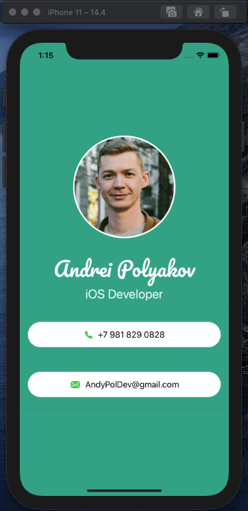

# MyCardSwiftUI

## Оглавление
- **[Описание](#Description)**
- **[Презентация](#Presentation)**

## Описание
Визитная карточка на SwiftUI. Учебный проект.

Простой проект на один экран, поля "телефон" и "email" не кликабельны. Написан с целью первичного ознакомления со SwiftUI.
___

## Презентация
### Основной экран

___

